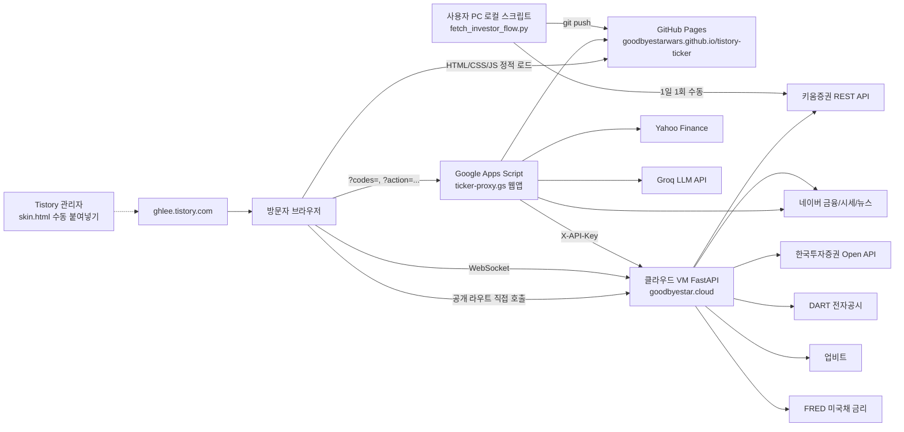

# 9Pay 증권 아키텍처 정의서

작성일: 2026-08-03 · 기준 커밋: `3565730` (`master`)

간단한 인프라 요약은 루트 `ARCHITECTURE.md`(다른 AI에게 붙여넣는 용도)를 본다. 이 문서는 컴포넌트 간 호출·인증·캐시·동시성 구조를 상세화한 것이다. 파일별 상세는 `SOURCE_CODE_SPEC.md`, DB 스키마는 `DB_SPEC.md`를 본다.

## 1. 시스템 컨텍스트

핵심 원칙: 브라우저가 직접 부르는 백엔드가 GAS와 VM 두 곳으로 나뉜다. GAS는 "캐싱이 필요하거나 비밀키(Groq)가 필요한" 대부분을, VM은 "실시간에 가까운 값이 필요하고 서버가 상시 떠 있어야 하는" 것을 담당한다(호가창 2초 폴링, 관심지수 리본, 사이드바 랭킹, 투자자별 매매동향 등).

## 2. 컴포넌트

### 2.1 GitHub Pages (정적 프론트)

- 저장소 `goodbyestarwars/tistory-ticker`의 `master` 브랜치를 그대로 서빙. `js/*.js`, `css/*.css`, `data/*.js`, `skin.html`(히스토리용), `style.css`.
- 파일명 버저닝 금지 — Tistory HTML에 URL이 고정 삽입되어 있어 기존 파일을 계속 덮어쓴다.
- push 후 1~10분 내 반영(캐시 `max-age=600`).

### 2.2 Google Apps Script 프록시 (`gas/ticker-proxy.gs`)

- 단일 GAS 프로젝트, 웹앱 배포. `doGet` 쿼리파라미터로 22개 라우트 처리(§3 `SOURCE_CODE_SPEC.md` 3.1 참고).
- 시크릿 3종(`GROQ_API_KEY`, `KIWOOM_VM_URL`, `KIWOOM_VM_TOKEN`)은 스크립트 속성(PropertiesService)에서만 로드 — 코드 하드코딩 없음(확인됨). 2026-08-03에 `DEBUG_ACCESS_KEY`(선택, 미설정 시 `?debugShortNaver=1` 디버그 라우트 전체 비활성화)가 추가되었다. Google Calendar API 키는 GAS로 이관하는 방안을 검토했으나, 사용자가 GCP 콘솔에 리퍼러 제한을 이미 걸어둔 상태라 원복했다(§5, §7 참고).
- `CacheService`로 응답 캐싱, TTL은 항목별 60초(장중 시세)~3시간(AI요약).
- VM 호출 시 `X-API-Key: {KIWOOM_VM_TOKEN}` 헤더로 인증.
- `master` push 시 GitHub Actions(`.github/workflows/deploy-gas.yml`)가 `clasp push`와 기존 배포 ID 대상 `clasp deploy`를 실행한다. 저장소 Secrets가 없거나 워크플로가 실패한 경우에만 script.google.com에서 수동 배포한다.
- 실행시간 6분 제한(Apps Script 정책). `getMarketTemp()`처럼 외부 호출 15회+가 직렬로 이어지는 경로가 있어(§4.2) 한도에 여유는 있으나 외부 API 지연이 겹치면 위험이 커질 수 있다.

### 2.3 클라우드 VM (`scripts/cloud-vm/`, FastAPI, `goodbyestar.cloud`)

- 엔트리포인트 `main.py`(`uvicorn main:app`), systemd 상시 구동.
- git push 후 VM이 약 5분 내 자동 재배포(구체 CI/CD는 저장소 밖 VM 설정).
- 대용량 `ohlc_snapshot.db`의 배포 직전 백업은 I/O 병목 이력으로 비활성화되어 있다. 대신 `deploy_check.sh`가 장외 시간에 `maintenance.py`를 실행해 뉴스 DB 삭제 전 `backup_sqlite.py` 백업, 앱 로그 상한, 뉴스·매물대 보존 정리, SQLite WAL 체크포인트·`PRAGMA optimize`를 수행한다. 주말에는 VM의 현재 syslog 계열 로그를 비우고 회전·압축 로그와 systemd journal도 정리한다. 배포 후 `/health`·`/news-momentum/000660`·인증 `/ohlc/005930`을 점검한다.
- `deploy_check.sh`는 전체를 `flock`으로 감싸 5분 타이머 중첩 실행을 방지하고, Asia/Seoul 날짜 마커로 뉴스모멘텀 8종목 배치를 하루 1회만 실행한다.

#### 2.3.1 인증 모델 (두 그룹)

| 그룹 | 라우트 예 | 인증 |
|---|---|---|
| GAS 전용(비공개) | `/quote`, `/ohlc/{code}`, `/naver-news`, `/investor-flow-batch`, `/fundamentals-batch`, `/fundamentals/{code}`, `/daily-scan-batch`, `/week52-batch` | `X-API-Key` 헤더 필수(`require_api_key`, `main.py:187-192`) |
| 브라우저 직접 호출(공개) | `/futures`, `/futures/avg`, `/option-flow`, `/market-rank`, `/order-book/{code}`, `/investor-trend`, `/investor-flow/{code}`, `/foreign-flow/{code}`, `/earnings-calendar`, `/news-momentum/{code}`, `/health`, `/health/latency` | 인증 없음, `CORSMiddleware`(`allow_origins=['https://ghlee.tistory.com']`, GET만)로 브라우저 측만 제한 |

CORS는 서버-서버 호출(브라우저가 아닌 curl/스크립트)에는 적용되지 않는다 — 즉 "공개" 그룹은 사실상 누구나 직접 호출 가능한 공개 API다. 이는 "GAS→VM 구간 간헐적 차단" 문제를 우회하기 위한 의도된 설계이며(`main.py:88-97` 주석), 공개 시세 데이터라 민감정보 노출은 아니지만 레이트리밋이 없다(상세는 `SOURCE_CODE_SPEC.md` §6.3).

`/ws/quotes`(WebSocket)는 `Origin` 헤더 검사로만 접근을 제한하며(`main.py:228-234`), 2026-08-03부터 동시 연결 수 상한(`_WS_MAX_CONNECTIONS=200`)도 함께 적용한다.

#### 2.3.2 백그라운드 프로세스 모델

`@app.on_event('startup')`(`main.py:53-84`)에서 스레드 기반 폴러를 기동한다.

| 폴러 | 조건 | 주기 | 대상 테이블 |
|---|---|---|---|
| `foreign_futures.start_background()` | 항상 | 심볼별 상이 | `future_prices`, `future_chart` |
| `domestic_futures.start_background()` | 항상 | 실시간 30초 / 분봉 5분 | `future_prices`, `future_chart`, `future_chart_minute` |
| `btc_futures.start_background()` | 항상 | - | `future_prices`, `future_chart` |
| `bond_yield.start_background()` | 항상 | - | `future_prices`, `future_chart` |
| `investor_trend.start_background()` | 항상(KIS/키움/네이버 자동 폴백) | 1분(오늘값) | `investor_trend_daily` |
| `night_futures_ws.start_background()` | `KIS_APPKEY/APPSECRET` 설정 + `websockets` 설치 시 | 실시간 WS, 5분마다 일/분봉 갱신 | `future_prices`, `future_chart`, `future_chart_minute` |
| `option_flow.start_background()` | `KIS_APPKEY/APPSECRET` 설정 시 | 5분(REST 폴링) | `option_flow` |

최대 7개 스레드가 동시에 `db_schema.get_conn()`으로 독립 커넥션을 열어 같은 `ohlc_snapshot.db`에 쓴다. `PRAGMA journal_mode=WAL` + `busy_timeout=600000`(`db_schema.py:136-139`)으로 파일 잠금 충돌은 대기 후 자동 해소되지만, **같은 키를 서로 다른 의미의 값으로 동시에 쓰는 논리적 충돌**은 이 메커니즘으로 막을 수 없다 — 실제로 `domestic_futures.py`와 `night_futures_ws.py`가 `KOSPI200_NIGHT` 분봉을 서로 다른 소스로 같은 행에 upsert하는 문제가 있었다(`SOURCE_CODE_SPEC.md` §6.2). **수정됨(2026-08-03)**: `domestic_futures.MINUTE_SYMBOLS`에서 `KOSPI200_NIGHT`를 제거해 `night_futures_ws.py`만 이 심볼의 분봉을 쓰도록 단일 소스화했다.

### 2.4 skin.html (Tistory 스킨 HTML)

- git 추적은 하지만 배포 경로가 아니다 — Tistory는 이 저장소를 pull하지 않는다.
- 실제 반영은 Tistory 관리자 → 꾸미기 → 스킨 편집 → HTML 편집에 수동 붙여넣기.
- 서버 치환 태그(`[##_..._##]`, `<s_xxx>`) 포함 블록만 남아 있고, 나머지는 `js/skin-shell.js`가 런타임 주입.

### 2.5 로컬 전용 데이터 수집 (`scripts/fetch_investor_flow.py`)

- 공매도/대차거래/연기금 데이터. 키움 API 앱키가 IP 등록 방식이라 GAS(공개 서버)나 유동 IP 클라우드에 둘 수 없음.
- 사용자 PC에서 하루 1회 로컬 실행 → `data/investor-flow-cache.js`를 git push.

## 3. 배포 경로

| 컴포넌트 | 저장 위치 | 배포 트리거 | 반영까지 |
|---|---|---|---|
| `js/*.js`, `css/*.css`, `data/*.js`, `style.css` | 이 저장소 | `master` push | 1~10분(GitHub Pages, 캐시 max-age=600) |
| `gas/ticker-proxy.gs` | 이 저장소 + GAS 프로젝트(별도) | **GitHub Actions 자동 배포** | Secrets/워크플로 실패 시 수동 대체 |
| `scripts/cloud-vm/*.py` | 이 저장소 + VM | git push 후 VM 자동 배포 | 약 5분 |
| `skin.html` | 이 저장소(히스토리) + Tistory 스킨 편집기 | **Tistory 관리자 수동 붙여넣기** | git push는 배포 경로 아님 |
| `data/investor-flow-cache.js` | 이 저장소 | 사용자 PC 로컬 1일 1회 수동 실행 → push | 즉시(수동) |

작업 브랜치는 항상 최종적으로 `master`에 merge되어야 실제 반영된다.

## 4. 캐싱 계층

이 시스템은 4단계 캐시를 갖는다.

| 계층 | 위치 | 대표 TTL | 목적 |
|---|---|---|---|
| 클라이언트 | `js/*.js` 내 디바운스/`CLIENT_CACHE_MS` | 수 초~5분 | 동일 종목 재조회 방지, 레이스 컨디션 최소화 |
| GAS `CacheService` | `gas/ticker-proxy.gs` | 60초(장중 시세)~3시간(AI요약) | Groq 비용 절감, 네이버/야후 크롤링 빈도 감소 |
| VM 프로세스 메모리 | `main.py` 전역 dict(`_ohlc_cache` 등) | 1.5초(호가)~30초(랭킹)~5분(수급/OHLC)~10분(실적캘린더) | 동시 다중 요청을 외부 TR 호출 1번으로 묶음 |
| VM SQLite | `ohlc_snapshot.db`, `news_momentum.db` | 배치 주기(일 1회)~1분(폴러) | 프로세스 재시작에도 유지되는 영속 저장 |

VM 메모리 캐시(`_ohlc_cache`, `_investor_flow_cache_mem`, `_foreign_flow_cache_mem`, `_futures_cache`)는 상한 도달 시 LRU가 아니라 전량 비움(`cache.clear()`) 방식이라, 트래픽이 몰릴 때 콜드패스가 한꺼번에 발생할 수 있다(`SOURCE_CODE_SPEC.md` §6.1).

GAS 캐시는 배포해도 자동으로 비워지지 않으므로, 응답 스키마를 바꿀 때는 캐시 키 버전을 올리는 관례(`market_temp_v5` 등)를 따른다. `?codes=` 라우트는 캐시 키에 사용자 입력이 그대로 들어가는데(`cacheKeyFor`), 예전에는 다른 라우트의 고정 캐시 키(`ticker_market_ribbon3` 등)와 충돌할 수 있는 상태였다(2026-08-03 리뷰에서 발견, 위험도 높음) — 같은 날 `cacheKeyFor`에 전용 네임스페이스(`quotes_`)를 추가해 수정했다(`SOURCE_CODE_SPEC.md` §6.3).

## 5. 외부 API / 데이터 소스

| 소스 | 용도 | 접근 경로 |
|---|---|---|
| 키움증권 정식 REST API | 시세, 수급, 호가, 랭킹, 차트, 공매도/대차/연기금 | VM(`kiwoom_client.py`) + 로컬 스크립트 |
| 한국투자증권(KIS) Open API | 야간선물, 시장별 투자자매매동향, 옵션 | VM(`kis_client.py`), GAS 일부 |
| 네이버 금융 | 실시간 시세(백업), 종목뉴스, 뉴스검색(VM 경유 IP 화이트리스트 우회) | GAS 직접 + VM(`naver_news.py`) |
| DART(전자공시) | 재무제표, 실적발표 캘린더 | VM(`dart_client.py`, `earnings_calendar.py`) |
| Groq API(`llama-3.3-70b-versatile`) | AI 요약 전반 | GAS(`callGroq`), 스크립트 속성에 키 저장 |
| 구글 캘린더 API | 증시캘린더 이벤트 | `js/stock-calendar.js`에 API 키 하드코딩(사용자 확인: GCP 콘솔에 리퍼러 제한 적용됨, 2026-08-03) |
| KRX 공시 RSS | 실시간 공시 피드 | GAS(`?market=0`) 경유 |
| 업비트 | BTC/ETH 시세 | VM(`btc_futures.py`) |
| FRED | 미국채 금리 | VM(`bond_yield.py`) |
| Yahoo Finance | VIX, S&P500 E-mini 선물 | GAS 직접 |
| KRX 내부 크롤링 경로 | ~~사용 중단~~ | **2026-07-11부로 완전 차단, 재도입 금지** |

## 6. 성능 특성 요약 (상세는 `SOURCE_CODE_SPEC.md` §6.1)

- GAS `getMarketTemp()`가 캐시 미스 시 외부 HTTP 15회 이상을 직렬 호출하는 것이 가장 큰 단일 지연 요인이었다 — 2026-08-03에 `sectors-v3.js` 중복 fetch와 `computeCombinedFlowScore_`의 중복 크롤링을 제거해 일부 완화했다(전면 병렬화는 리스크 대비 효과가 작아 보류).
- VM 메모리 캐시의 "전량 비움" 정책은 트래픽 스파이크 시 thundering herd를 유발할 수 있었다 — 2026-08-03에 6개 캐시 전부 `OrderedDict` 기반 LRU로 교체해 해결했다.
- `/futures`에 대한 GZip 압축(`main.py:98-102`, `minimum_size=500`)과 SQLite 즉시읽기 TTL(`_FUTURES_TTL=10`)은 2026-07-31 "첫 로딩 30초" 장애 대응으로 이미 반영되어 있다.
- GAS `fetchQuotesWithCap`(히트맵)과 `getRankingNews`(랭킹뉴스)의 순차 `UrlFetchApp.fetch` 반복도 2026-08-03에 `fetchAll` 병렬 패턴으로 교체했다.
- `kis_client.py`의 옵션수급 5분 폴링마다 상시 실행되던 디버그 크로스체크 API 호출(+응답 원문 로깅)도 2026-08-03에 제거했다.

## 7. 보안 아키텍처 관점 요약 (상세는 `SOURCE_CODE_SPEC.md` §6.3)

이 절은 2026-08-03 리뷰 시점의 발견 사실이다. 같은 날 후속 작업 2건으로 `gas/ticker-proxy.gs` 항목, 이어서 VM(`main.py` 등)·프론트(`js/`) 항목까지 대부분 실제로 수정했다. `.nav-logo-name` 깨진 문구(사용자 확인 필요)만 미수정으로 남아 있다.

- 시크릿 관리: VM은 환경변수, GAS는 스크립트 속성 — 코드 하드코딩 없음(백엔드/GAS 확인 완료). 예외인 프론트엔드 `js/stock-calendar.js`의 Google Calendar API 키는 GAS 프록시 이관을 한 차례 적용했다가 원복했다 — 사용자가 GCP 콘솔에 리퍼러 제한(이 블로그 도메인만 허용)을 이미 걸어둔 상태라 키가 노출돼도 다른 도메인에서 남용할 수 없어, GAS 경유의 실익이 없다고 판단했다.
- 인증 경계: GAS↔VM은 `X-API-Key`로 보호되지만, VM의 "브라우저 공개" 라우트군은 CORS만으로는 서버-서버 호출을 막지 못해 사실상 공개 API다. **부분 수정(2026-08-03)**: 종목코드별 캐시로 순회 남용에 특히 취약한 3개 라우트(`/investor-flow/{code}`,`/foreign-flow/{code}`,`/order-book/{code}`)에 IP당 분당 요청 상한을 추가했다. 나머지 라우트(고정 키/좁은 파라미터 공간이라 캐시가 이미 효과적)는 대상에서 제외했다.
- `/ws/quotes`의 `Origin` 헤더 검사 우회 가능성 자체는 구조적 한계로 남아있지만, **부분 수정(2026-08-03)**: 동시 연결 수 상한(`_WS_MAX_CONNECTIONS=200`)을 추가해 자원 고갈 규모를 제한했다.
- `main.py`의 `require_api_key` 비상수시간 비교도 **수정 완료**: `hmac.compare_digest`로 교체.
- GAS 캐시 키 네임스페이스 충돌(`?codes=` vs 고정 키)로 인한 캐시 포이즈닝은 이번 리뷰에서 발견된 가장 위험도 높은 항목이었다 — **수정 완료**: `cacheKeyFor`에 `quotes_` 네임스페이스를 추가해 다른 라우트의 고정 키와 겹치지 않도록 분리.
- GAS `getFlowAiSummary`의 프롬프트 인젝션·캐시 오염도 **수정 완료**: 입력값 정제(길이 제한·제어문자 제거) + 캐시 키에 입력 해시를 포함시켜 위조 입력이 정상 캐시를 덮어쓰지 못하도록 격리.
- GAS `?debugShortNaver=1` 디버그 엔드포인트 무인증 노출도 **수정 완료**: 스크립트 속성 `DEBUG_ACCESS_KEY` 검증을 추가해 기본적으로 비활성화.
- `js/marketcap-bubble.js`의 `innerHTML` 이스케이프 누락, `js/quick-indices.js`의 도달 불가 죽은 코드 이스케이프 누락도 **수정 완료**(기존 escape 유틸 적용).
- 코스피200 야간선물 분봉 데이터 정확성 버그(`domestic_futures.py` vs `night_futures_ws.py`)도 **수정 완료**: 야간선물 분봉을 `night_futures_ws.py` 단일 소스로 정리.
- SQL 인젝션, 커맨드 인젝션, 하드코딩된 백엔드 시크릿은 전수 조사 결과 발견되지 않았다.

## 8. 이 문서가 다루지 않는 것

파일별 상세 함수 목록은 `SOURCE_CODE_SPEC.md`, DB 테이블 정의는 `DB_SPEC.md`, UI/색상 규칙은 `UI_GUIDE.md`, 파일별 변경 이력은 `WORK_HISTORY.md`를 본다.
