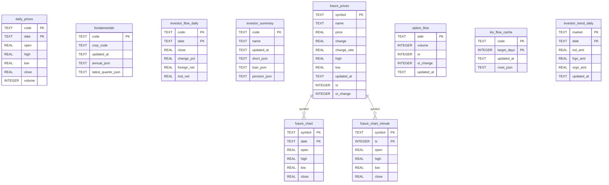
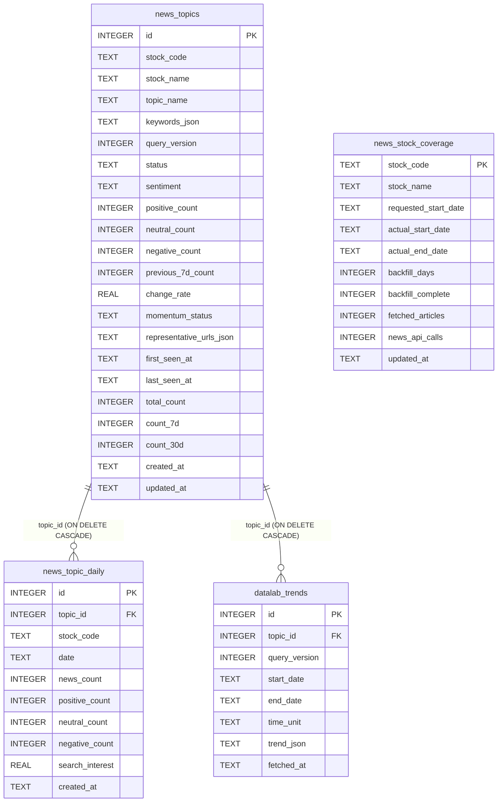

# 9Pay 증권 DB 정의서

작성일: 2026-08-17 · 운영 기준 커밋: `0f18642` (`origin/master`) · 근거: `scripts/cloud-vm/db_schema.py`, `scripts/cloud-vm/news_momentum.py`, `domestic_news.py`, `news_aggregator.py`, `us_analysis.py` 확인

이 서비스는 전통적 DB 서버가 아니라 **VM 로컬 SQLite 파일 6개** + **VM 로컬 JSON 캐시 파일 다수** + **저장소 내 정적 `window.XXX` 데이터 파일**로 데이터를 관리한다. 이 문서는 세 계층을 모두 정의한다. SQLite 파일은 `ohlc_snapshot.db`(시세·수급·사용자 설정·스윙 스냅샷), `news_momentum.db`(종목 뉴스 이슈), `domestic_news.db`(국내 일반뉴스·DART 공시), `us_news_cache.db`(미국 종목·글로벌 뉴스 메타데이터), `us_analysis_cache.db`(미국 종목 프로필·분석 캐시), `us_congress_trades_cache.db`(미국 의회 거래 공시 캐시)다.

## 목차

1. 개요 — DB를 왜 이렇게 나눴는가
2. `ohlc_snapshot.db` (SQLite)
3. `news_momentum.db` (SQLite)
4. 기타 SQLite 캐시 파일 — `domestic_news.db`, `us_news_cache.db`, `us_analysis_cache.db`, `us_congress_trades_cache.db`
5. 파일 기반 캐시(JSON)
6. 파일 기반 정적 데이터(`window.XXX` .js)
7. 백업/보존 정책
8. 마이그레이션 이력
9. 알려진 이슈

---

## 1. 개요

`db_schema.py` 모듈 상단 주석(원문): "종목 하나씩 `SELECT ... WHERE code=?`로 커서 순회하면 전체 종목 수와 무관하게 메모리에 종목 1개분만 올라가는 게 SQLite를 고른 핵심 이유(JSON 전체 로드 시 메모리 4배 증폭 실측됨)." — 즉 배치가 다루는 종목 수(약 2,700~3,000)가 커지면서 JSON 캐시 파일 전체 로드 방식의 메모리 비용이 문제가 되어 SQLite로 점진 이관한 것이 설계 배경이다. 다만 일부 API(`/investor-flow-batch`, `/fundamentals-batch`, `/daily-scan-batch`, `/week52-batch`)는 여전히 JSON 파일 캐시를 응답 원본으로 쓴다(§5).

`news_momentum.db`는 `ohlc_snapshot.db`와 **완전히 분리된 별도 파일**이다 — 뉴스 원문/HTML/이미지는 저장하지 않고 집계 결과만 저장하며, 사용자 요청 시(`/news-momentum/{code}`) 외부 API를 호출하지 않고 이 DB만 읽는다. 국내뉴스/DART와 미국뉴스/미국분석 캐시도 각각 별도 파일로 분리해 공급자 실패나 보존 정책이 서로 영향을 주지 않게 한다.

`ohlc_snapshot.db`, `news_momentum.db`, 미국뉴스 캐시는 `WAL`을 사용한다. 국내뉴스·미국분석 캐시는 작은 온디맨드 캐시이므로 연결 시 `WAL`과 짧은 busy timeout을 설정한다.

---

## 2. `ohlc_snapshot.db`

경로: `scripts/cloud-vm/ohlc_snapshot.db` (VM 로컬, 이 저장소에는 없음) · 스키마 정의: `db_schema.py:18-249` · 연결: `get_conn()` — `timeout=600`, `PRAGMA journal_mode=WAL`, `PRAGMA busy_timeout=600000`(10분, 장시간 배치의 쓰기 트랜잭션과 충돌 방지).

### ERD

(`future_prices`↔`future_chart`류는 FK 제약이 실제로 걸려 있지 않음 — 애플리케이션 레벨에서만 symbol로 연결)

### 2.1 `daily_prices` — 종목 일봉 260일

| 컬럼 | 타입 | 제약 | 설명 |
|---|---|---|---|
| code | TEXT | PK(복합) | 6자리 종목코드 |
| date | TEXT | PK(복합) | YYYY-MM-DD |
| open/high/low/close | REAL | | 원 |
| volume | INTEGER | | 주 |

인덱스: `idx_daily_prices_code`. INSERT 주체: `daily_scan.py`(일 1회 배치). 읽기: `week52_scan.py`, `rescan_patterns.py`가 API 재호출 없이 이 DB만 재사용.

### 2.2 `fundamentals` — DART 재무제표 요약

| 컬럼 | 타입 | 설명 |
|---|---|---|
| code | TEXT PK | 종목코드 |
| corp_code | TEXT | DART 기업 고유코드 |
| updated_at | TEXT | 갱신 시각 |
| annual_json | TEXT | 5년 연간 추세 직렬화 |
| latest_quarter_json | TEXT | 최근분기 YoY 직렬화 |

`migrate_fundamentals.py`가 구버전 `fundamentals_cache.json`에서 증분 이관. `/fundamentals-batch`, `/fundamentals/{code}`의 원본.

### 2.3 `investor_flow_daily` — 외국인/기관 일별 순매매

| 컬럼 | 타입 | 설명 |
|---|---|---|
| code, date | TEXT PK(복합) | |
| close | REAL | 원 |
| change_pct | REAL | % |
| foreign_net, inst_net | REAL | 주(순매수, 부호 있음) |

ka10045 기반. 인덱스 `idx_investor_flow_daily_code`. `daily_scan.py`가 투자시그널 계산 과정에서 얻는 값을 버리지 않고 같이 저장.

### 2.4 `investor_summary` — 공매도/대차거래/연기금 요약

| 컬럼 | 타입 | 설명 |
|---|---|---|
| code | TEXT PK | |
| name | TEXT | 종목명 |
| updated_at | TEXT | |
| short_json | TEXT | 공매도(ka10014) 직렬화 |
| loan_json | TEXT | 대차거래(ka20068) 직렬화 |
| pension_json | TEXT | 연기금(ka10059) 직렬화 |

`migrate_investor_summary.py`가 `investor_flow_cache.json` 전량 이관.

### 2.5 `future_prices` — 선물/지수/환율/원자재/코인 최신값

| 컬럼 | 타입 | 설명 |
|---|---|---|
| symbol | TEXT PK | 21개 고정 심볼(KOSPI, KOSDAQ, NASDAQ_INDEX 등, `API_REFERENCE.md` `/futures` 참고) |
| name, price, change, change_rate, high, low | | 지수는 포인트, 환율은 원, 채권은 %, 코인은 해당 통화 |
| updated_at | TEXT | |
| oi, oi_change | INTEGER | 미결제약정 — `KOSPI200_NIGHT`만 값 존재(마이그레이션으로 추가된 컬럼, §7) |

UPSERT: `upsert_future_price()`(`db_schema.py:223-234`), `ON CONFLICT(symbol) DO UPDATE`.

### 2.6 `option_flow` — 콜/풋 옵션 수급(최근월물, side 단위 집계)

| 컬럼 | 타입 | 설명 |
|---|---|---|
| side | TEXT PK | `'CALL'` \| `'PUT'` |
| volume, oi, oi_change | INTEGER | 계약수 |
| updated_at | TEXT | |

전체 만기 합산이 아니라 최근월물 기준 1행씩만 저장(상세 행사가별 데이터는 저장하지 않음).

같은 DB의 `option_flow_strike`는 최근월물의 행사가별 원자료를 보관한다.

| 컬럼 | 타입 | 제약 | 설명 |
|---|---|---|---|
| side | TEXT | PK(복합) | `CALL` 또는 `PUT` |
| strike | REAL | PK(복합) | 행사가 |
| volume, oi, oi_change | INTEGER | | 계약수 |
| updated_at | TEXT | | 수집 시각 |

인덱스: `idx_option_flow_strike_side`. 합계 카드와 행사가별 프로파일을 같은 수집 결과에서 제공하기 위한 테이블이다.

### 2.7 `future_chart` / `future_chart_minute` — 선물류 일봉/분봉

| 테이블 | PK | 컬럼 |
|---|---|---|
| future_chart | (symbol, date) | open/high/low/close |
| future_chart_minute | (symbol, ts) | open/high/low/close (ts=UTC epoch초) |

`load_future_chart(limit_days)`는 행 개수 제한, `load_future_chart_since(since_date)`는 날짜 하한 필터 — 심볼마다 거래일 밀도가 달라(채권 주5일 vs BTC 주7일) "N일치"의 의미가 달라지는 문제(2026-07-18 발견)를 `/futures/avg`에서 회피하기 위해 후자를 쓴다. `load_future_chart_minute`은 최근 1,500봉(대략 3~4거래일)만 반환.

### 2.8 `kis_flow_cache` — KIS 종목별 투자자매매동향 온디맨드 캐시

| 컬럼 | 타입 | 설명 |
|---|---|---|
| code | TEXT PK(복합) | |
| target_days | INTEGER PK(복합) | 조회 기간(5개 선택지) |
| updated_at, rows_json | TEXT | |

KIS `FHPTJ04160001`이 00:00~15:40(KST)에 TR 자체가 막히는 정책 때문에 도입(2026-07-19). `daily_prices`/`investor_flow_daily`와 달리 배치 대상이 아니라 **온디맨드로 조회된 종목만** 쌓이므로 무한정 커지지 않는다(최악 "조회된 종목 수 × 5"행 수준).

### 2.9 `investor_trend_daily` — 시장별 투자자매매 동향(홈 위젯)

| 컬럼 | 타입 | 설명 |
|---|---|---|
| market | TEXT PK(복합) | `'KOSPI'` \| `'KOSDAQ'` |
| date | TEXT PK(복합) | YYYYMMDD |
| ind_amt, frgn_amt, orgn_amt | REAL | 억원(순매수, 부호 있음) |
| updated_at | TEXT | |

당일(장중) 행은 재조회 때마다 UPSERT로 갱신, 과거 확정일은 불변. `load_investor_trend_daily(limit_days=140)`가 주/월 집계의 기반.

### 2.10 `volume_profile_daily` — 종목분석 매물대 "실제 체결가" 뷰 온디맨드 누적

| 컬럼 | 타입 | 설명 |
|---|---|---|
| code | TEXT PK(복합) | |
| trade_date | TEXT PK(복합) | YYYY-MM-DD(KST) |
| price | REAL PK(복합) | 실제 체결가(호가단위) |
| volume | REAL | 그날 그 가격의 누적 체결거래량 |
| updated_at | TEXT | |

`kis_flow_cache`와 동일하게 배치 없이 **온디맨드로 조회된 종목만** 쌓인다(2026-08-05 도입). KIS `pbar-tratio`(FHPST01130000) 응답 자체가 이미 "그 시점까지의 당일 누적치"라 같은 날 안에서는 UPSERT로 덮어쓰기만 하고 더하지 않는다 - 날짜가 바뀌면 그 행은 더 이상 갱신되지 않아 그날의 마감 근접 스냅샷으로 자연히 고정된다. `main.py`의 `GET /pbar-tratio/{code}?days=N`이 요청마다 오늘 스냅샷을 저장하고, 저장된 과거 거래일(최대 N-1개, `exclude_date`로 오늘 제외)과 오늘 실시간 응답을 가격별로 합산해 반환한다. 그래서 "최근 N일"은 정확히 최근 N거래일이 아니라 "조회된 적 있는 날짜 중 최근 N개"다. 200일보다 오래된 행은 `main.py`가 시간당 최대 1회 정리(`_maybe_prune_volume_profile`, 120거래일 + 주말/휴장일 여유분).

---

### 2.11 `sector_cards_config` — 공용 증시온도 카드 설정

| 컬럼 | 타입 | 제약 | 설명 |
|---|---|---|---|
| id | INTEGER | PK, 항상 1 | 공용 단일 설정 행 |
| config_json | TEXT | NOT NULL | 섹터 카드 구성 JSON |
| revision | INTEGER | NOT NULL | 낙관적 동시성 제어 버전 |
| updated_at | TEXT | NOT NULL | 저장 시각 |

운영자가 편집하는 공용 기본값이다. 시세·분석 원자료와 분리되어 있으며 `/sector-cards`가 읽고 관리자 API가 교체한다.

### 2.12 `app_users` — Google 로그인 사용자

| 컬럼 | 타입 | 제약 | 설명 |
|---|---|---|---|
| id | INTEGER | PK AUTOINCREMENT | 내부 사용자 ID |
| google_sub | TEXT | UNIQUE, NOT NULL | Google 계정의 불변 subject |
| email | TEXT | NOT NULL | 로그인 이메일 |
| name | TEXT | NOT NULL | 표시 이름 |
| created_at, updated_at | TEXT | NOT NULL | 계정 생성·갱신 시각 |

비밀번호를 저장하지 않는다. VM의 HttpOnly 세션이 Google `sub`와 연결한다.

### 2.13 `watchlist_configs` — 사용자별 관심종목

| 컬럼 | 타입 | 제약 | 설명 |
|---|---|---|---|
| user_id | INTEGER | PK, FK | `app_users.id`, 삭제 CASCADE |
| config_json | TEXT | NOT NULL | 종목·그룹·순서·접힘 상태 |
| revision | INTEGER | NOT NULL | 충돌 감지 버전 |
| updated_at | TEXT | NOT NULL | 저장 시각 |

브라우저 `localStorage`가 원본이 아니다. `/watchlist`의 GET/PUT이 Google 로그인 사용자별 설정을 읽고 저장한다.

### 2.14 `user_sector_cards_config` — 사용자별 증시온도 카드 편집본

| 컬럼 | 타입 | 제약 | 설명 |
|---|---|---|---|
| user_id | INTEGER | PK, FK | `app_users.id`, 삭제 CASCADE |
| config_json | TEXT | NOT NULL | 개인 섹터 카드 구성 JSON |
| revision | INTEGER | NOT NULL | 충돌 감지 버전 |
| updated_at | TEXT | NOT NULL | 저장 시각 |

행이 없으면 `sector_cards_config` 공용 기본값을 사용하고, DELETE 시 개인 편집본을 지워 기본값으로 돌아간다.

### 2.15 `swing_recommendation_snapshots` — 국내 2주 스윙 판정 스냅샷

복합 PK는 `(as_of_date, code, model_version)`이다. 차트 국면·대/중/소 파동·모멘텀·펀더멘털·위험·보유자 행동·신규 진입 의견을 판정 당시 값으로 보존한다. `wave_events_json`·`risk_reasons_json`·`auxiliary_states_json`은 상세 근거 배열을 JSON으로 저장한다.

| 범주 | 컬럼 |
|---|---|
| 식별/가격 | `as_of_date`, `code`, `name`, `model_version`, `close`, `created_at` |
| 차트/이평 | `chart_regime`, `current_regime`, `recent_event`, `recent_event_stage`, `ma5`, `ma20`, `ma60`, `ma224`, `relative_strength`, `invalidation_condition` |
| 멀티 타임프레임 | `big_wave`, `mid_wave`, `small_wave`, `wave_diagnosis`, `wave_events_json` |
| 보조 상태 | `momentum_state`, `fundamental_state`, `risk_state`, `risk_reasons_json`, `turning_point` |
| 행동/비교 | `holder_action`, `entry_opinion`, `internal_priority_score`, `legacy_score`, `legacy_stars`, `legacy_label` |
| 사후 검증 | `t5_return`, `t10_return`, `t20_return`, `t5_excess_return`, `t10_excess_return`, `t20_excess_return`, `t20_regime`, `t20_regime_changed`, `mfe`, `mae`, `outcome_updated_at` |

구 레거시 별점·점수 컬럼은 회귀 비교용이며 새 판정의 단일 근거가 아니다. `daily_scan.py`가 판정 스냅샷을 저장하고 `monitor_swing_recommendations.py`가 T+5/T+10 결과를 후속 갱신한다. **2026-08-22**: 운영 기간을 4주(T+5/T+10/T+20)에서 2주(T+5/T+10)로 좁히면서 `t20_*` 컬럼은 하위호환을 위해 스키마에 남겨뒀지만 더 이상 채워지지 않는다(옛 4주 모델 시절 값만 남아있음). `mfe`/`mae`도 이제 T+10(10거래일) 기준으로 계산한다.

---

## 3. `news_momentum.db`

경로: `scripts/cloud-vm/news_momentum.db` (VM 로컬) · 스키마 정의: `news_momentum.py:23-96` · 연결: `get_conn()` — `timeout=5`, `row_factory=sqlite3.Row`, `PRAGMA journal_mode=WAL`, `synchronous=NORMAL`, `foreign_keys=ON`, `busy_timeout=5000`, `temp_store=MEMORY`.

### ERD

### 3.1 `news_topics` — 종목별 반복 이슈

`UNIQUE(stock_code, topic_name)`. 감성 집계(`positive_count`/`neutral_count`/`negative_count`), 모멘텀 상태(`momentum_status`: `new`/`expanding`/`declining`/`persistent`), 활성 여부(`status`: 기본 `'active'`)를 담는다. 근거 없는 행은 감성 카운트가 `NULL`로 남고 임의로 0건 처리하지 않는다(`API_REFERENCE.md` `/news-momentum/{code}` 참고).

### 3.2 `news_topic_daily` — 이슈별 일별 기사 수 + 검색관심도

`UNIQUE(topic_id, date)`, `topic_id`는 `news_topics(id)`를 `ON DELETE CASCADE`로 참조 — 이슈가 삭제되면(정리 스크립트 등) 일별 행도 자동 삭제된다. `search_interest`는 NAVER DataLab 상대지수.

### 3.3 `datalab_trends` — DataLab 검색어 트렌드 원본 응답

`topic_id`가 `news_topics(id)`를 `ON DELETE CASCADE`로 참조. `query_version`으로 검색어 조합이 바뀔 때 이전 트렌드와 구분한다.

### 3.4 `news_stock_coverage` — 종목별 90일 백필 진행 상태

| 컬럼 | 설명 |
|---|---|
| stock_code | PK |
| requested_start_date / actual_start_date / actual_end_date | 요청 시작일 vs 실제 도달일 |
| backfill_complete | 1,000건 한도로 90일 경계에 못 닿으면 0 |
| fetched_articles, news_api_calls | 배치 예산 소진 여부 판단용 |

화면의 "데이터 기준일"/"최근 90일 뉴스 백필 완료/부분" 표시는 이 테이블 값을 그대로 쓴다.

### 3.5 인덱스

`idx_news_topics_stock_code`, `idx_news_topics_stock_status(stock_code, status)`, `idx_news_topics_last_seen`, `idx_news_topic_daily_topic_date(topic_id, date)`, `idx_news_topic_daily_stock_date(stock_code, date)`, `idx_datalab_trends_topic_fetched(topic_id, fetched_at)`.

### 3.6 Feature Flag / 예산

`.env`의 `NEWS_MOMENTUM_ENABLED=0`이면 이 DB를 열지 않고 `enabled:false`를 반환한다. 배치 예산은 네이버 검색 API(일 22,000회/월 680,000회, `/naver-news`와 공유)와 DataLab(일 900회)로 이원화되어 `news_momentum_cursor.json`(VM 로컬 상태 파일, DB 아님)에 KST 일·월 단위로 누적된다.

---

## 4. 기타 SQLite 캐시 파일

### 4.1 `domestic_news.db` — 국내 일반뉴스·DART 공시

경로: `scripts/cloud-vm/domestic_news.db` · 스키마 생성: `domestic_news._connect()`.

| 컬럼 | 설명 |
|---|---|
| `item_key` | canonical URL 또는 제목의 SHA-1, PK |
| `title`, `link`, `description` | 제목·원문 링크·설명 |
| `pub_date`, `source` | 발행 시각·매체 |
| `category`, `kind` | 실적/공시/시장 등 분류 및 항목 종류 |
| `stock_code`, `stock_name`, `relevance` | 종목 연결·관련도 |
| `fetched_at` | 수집 epoch 시각 |

`/domestic-news`, `/earnings-calendar`, 관심종목 주간공시가 사용한다. 같은 제목/URL은
`item_key`로 합치며, DART 원문 자체를 저장하는 DB가 아니라 화면에 필요한 공시 메타데이터
캐시다. 국내시장 선택 시 국내 일반뉴스와 DART 공시를 기준으로 사용한다.

### 4.2 `us_news_cache.db` — 미국 종목·글로벌 뉴스 메타데이터

경로: `scripts/cloud-vm/us_news_cache.db`(환경변수 `US_NEWS_CACHE_DB`로 대체 가능) ·
스키마 생성: `news_aggregator._cache_connect()`.

`us_news_cache(symbol, link, title, pub_date, source, provider, sentiment_json,
published_ts, fetched_at)`와 `us_news_cache_meta(symbol, fetched_at)`를 둔다.
기사 본문·HTML·이미지는 저장하지 않고 제목·출처·발행시각·원문 링크·감성 메타데이터만
보관한다. 종목뉴스 기본 TTL은 30분, 일반뉴스 메모리 캐시 TTL은 5분이다. Alpha Vantage,
Finnhub, Google News RSS, Naver fallback 결과가 같은 캐시 정책을 공유한다.

### 4.3 `us_analysis_cache.db` — 미국 종목 분석 캐시

경로: `scripts/cloud-vm/us_analysis_cache.db`(환경변수 `US_ANALYSIS_CACHE_DB`로 대체 가능).
테이블 `us_analysis_cache(symbol TEXT PRIMARY KEY, payload_json TEXT NOT NULL,
fetched_at INTEGER NOT NULL)` 하나를 사용한다. `/us-analysis/{symbol}`에서 Finnhub
기업 프로필·분석 데이터를 재사용하며 분석 캐시 TTL은 6시간, 프로필 메모리 캐시 TTL은
24시간이다. 키가 없거나 공급자가 실패하면 빈/부분 응답으로 폴백하며 API 키를 저장소에
기록하지 않는다.

### 4.4 `us_congress_trades_cache.db` — 미국 의회 거래 공시 캐시

경로: `scripts/cloud-vm/us_congress_trades_cache.db`(환경변수 `US_CONGRESS_CACHE_DB`로
대체 가능). 테이블 `us_congress_trades_cache(symbol TEXT PRIMARY KEY, payload_json TEXT
NOT NULL, fetched_at INTEGER NOT NULL)` 하나를 사용한다. `/us-congress-trades/{symbol}`에서
Quiver Congress Trading의 최근 공시를 3시간 재사용하며, 실제 거래일·신고일·지연일수와
금액구간을 포함한 정규화 응답을 저장한다. `QUIVER_API_KEY`가 없으면 외부 호출 없이
명시적인 미제공 응답을 반환한다.

---

## 5. 파일 기반 캐시(JSON, VM 로컬)

`ohlc_snapshot.db`로 전부 이관되지 않은 배치 결과는 여전히 JSON 파일로 캐시되며 `main.py`가 파일 mtime/크기 변경 시에만 재파싱한다.

| 파일 | 채우는 스크립트 | 소비하는 라우트 |
|---|---|---|
| `investor_flow_cache.json` | `batch_scan.py`(하루 1회) | `/investor-flow-batch` |
| `fundamentals_cache.json` | `batch_scan.py`(하루 1회), 이후 `migrate_fundamentals.py`로 SQLite 이관 진행 중 | `/fundamentals-batch`, `/fundamentals/{code}` |
| `daily_scan_cache.json` | `daily_scan.py`(하루 1회) | `/daily-scan-batch`(패턴/눌림목/투자시그널) |
| `week52_cache.json` | `week52_scan.py`(하루 1회) | `/week52-batch` |
| `strategy_scan_cache.json` | `strategy_scan.py`(하루 1회) | `/strategy-scan-batch` |
| `weekly_report_cache.json` | `main.py` 주간 리포트 생성 | `/weekly-report`의 주간 스냅샷 재사용 |
| `latency_monitor.log` | `latency_monitor.py`(5분 주기) | `/health/latency` |
| `news_momentum_cursor.json` | `news_momentum_scan.py` | 배치 자체(전종목 이어달리기 커서 + API 호출 예산 누적) |

이 파일들은 이 git 저장소에는 없다(VM 로컬 생성물, `.gitignore` 대상).

---

## 6. 파일 기반 정적 데이터 (`data/`, `window.XXX` 규약)

프론트엔드는 별도 DB 없이 저장소에 커밋된 정적 `.js` 파일을 "읽기 전용 참조 테이블"처럼 쓴다.

| 파일 | 전역 변수 | 사실상의 스키마 | 갱신 |
|---|---|---|---|
| `data/krx_map.js` | `window.KRX_MAP` | `{ [종목명]: 코드6자리 }` | 수동 |
| `data/wics-map.js` | `window.WICS_MAP` | `{ [코드]: {name, sector, industry} }` | 수동 |
| `data/sectors-v3.js` | (배열 리터럴) | `[{ name, code, market }]` × 37개 섹터, 종목 중복 소속 허용 | 수동, `sectors-v3-검수표.md`로 사람이 대조 |
| `data/marketcap-codes.js` | (배열/객체 리터럴) | ETF/레버리지/인버스 코드 목록 | 수동 |
| `data/investor-flow-cache.js` | `window.INVESTOR_FLOW_CACHE` | `{ [코드]: {공매도/대차/연기금 요약} }`, `sectors-v3.js` 종목 풀만 커버 | PC 로컬 스크립트 1일 1회 → git push |

이 파일들은 GAS(`fetchSectorUniverseWithSectors_` 등)가 HTTP GET으로 텍스트째 받아 정규식으로 파싱하는 방식으로도 재사용된다(§2 아키텍처 정의서 §5 참고) — 즉 GitHub Pages가 사실상 "읽기 전용 API 서버" 역할도 겸한다.

---

## 7. 백업/보존 정책

- `backup_sqlite.py`: 장외 유지보수에서 삭제 전 `news_momentum.db`를 `backups/`에 원자적 백업하고 무결성 검사 후 **최근 7개만 보관**한다. 대용량 `ohlc_snapshot.db`의 배포 직전 백업은 I/O 병목 이력 때문에 비활성화되어 있다.
- `news_momentum.db`는 `RETENTION_DAYS = 90`(`news_momentum.py:20`) 기준으로 `maintenance.py`가 장외 시간에 `news_topic_daily`와 종료된 이슈의 오래된 DataLab 원본을 삭제한다.
- `volume_profile_daily`는 `maintenance.py`와 API 요청 경로가 200일 이전 행을 삭제한다. 운영 SQLite는 장외 유지보수 때 대상 DB별로 WAL 체크포인트와 `PRAGMA optimize`를 실행하며, 온디맨드 뉴스 캐시는 자체 TTL·UPSERT 정책으로 관리한다.
- 앱 로그는 최근 10,000줄만 유지한다. 주말 장외 유지보수에는 root 권한이 필요한 VM OS 정리도 비대화식 `sudo -n`으로 수행한다: 현재 syslog 계열 파일은 0바이트로 만들고, `/var/log` 바로 아래의 회전·압축 로그를 삭제하며, systemd journal은 14일·500MB 상한으로 vacuum한다. 권한이 없으면 유지보수를 실패 처리해 날짜 마커를 남기지 않고 다음 회차에 재시도한다.
- `verify_news_momentum_db.py`가 배포 검증 단계에서 `news_momentum.db`의 무결성/커버리지를 점검한다.
- GAS `CacheService`는 자체 만료(TTL) 외 별도 백업이 없다 — 애초에 재생성 가능한 캐시이므로 보존 대상이 아니다.

## 8. 마이그레이션 이력 (코드 근거 기준)

| 시점(주석 기준) | 변경 | 처리 방식 |
|---|---|---|
| (버전 미상) | `future_prices`에 `oi`/`oi_change` 컬럼 추가 | `_ensure_column()`(`db_schema.py:142-148`)로 `ALTER TABLE ADD COLUMN` |
| 2026-07-20 | `investor_trend_daily`를 코스피 단일 시장→다중 시장으로 확장, PK를 `date`→`(market, date)` 복합키로 변경 | `_migrate_investor_trend_market()`(`db_schema.py:150-174`) — SQLite가 PK 변경을 지원하지 않아 테이블 RENAME→재생성→INSERT SELECT→DROP 방식, 기존 행은 전부 `'KOSPI'`로 태깅(재수집 가능한 데이터라 유실 부담 없음) |
| (버전 미상) | `fundamentals_cache.json` → `fundamentals` 테이블 | `migrate_fundamentals.py`(증분) |
| (버전 미상) | `investor_flow_cache.json` → `investor_summary` 테이블 | `migrate_investor_summary.py`(전량) |

`create_schema(conn)`(`db_schema.py:177-182`)가 `CREATE TABLE IF NOT EXISTS` 실행 후 위 두 마이그레이션 헬퍼를 매번 호출하므로, 스키마는 기동 시점마다 최신 상태로 자체 수렴한다(idempotent).

## 9. 알려진 이슈

- **동시 쓰기 스레드 다수 vs 단일 SQLite 파일**: `ohlc_snapshot.db`에 최대 7개 백그라운드 폴러 + 요청 핸들러가 동시에 쓴다. WAL/busy_timeout으로 파일 잠금 충돌은 해소되지만, `future_chart_minute`의 `KOSPI200_NIGHT` 심볼처럼 **서로 다른 두 폴러가 같은 키를 다른 값으로 upsert**하는 논리적 충돌은 스키마·동시성 설정만으로 막을 수 없다(`ARCHITECTURE_SPEC.md` §2.3.2, `SOURCE_CODE_SPEC.md` §6.2 참고).
- **JSON 캐시와 SQLite의 이원화가 진행 중**: `fundamentals`/`investor_summary`는 SQLite로 이관됐지만 `daily_scan_cache.json`/`week52_cache.json`은 여전히 파일 기반이다 — 두 저장 방식이 당분간 공존한다.
- **운영 장기 보존 정책**: `maintenance.py`가 장외 시간에 뉴스·매물대 보존 정리를 수행한다(§6). 운영 VM에서는 `deploy_check.sh`의 유지보수 로그와 날짜 마커로 실행 성공 여부를 확인한다.
